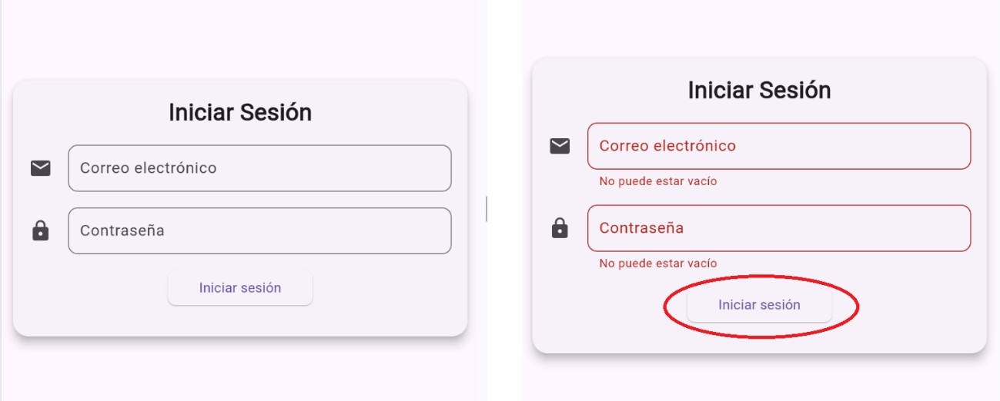
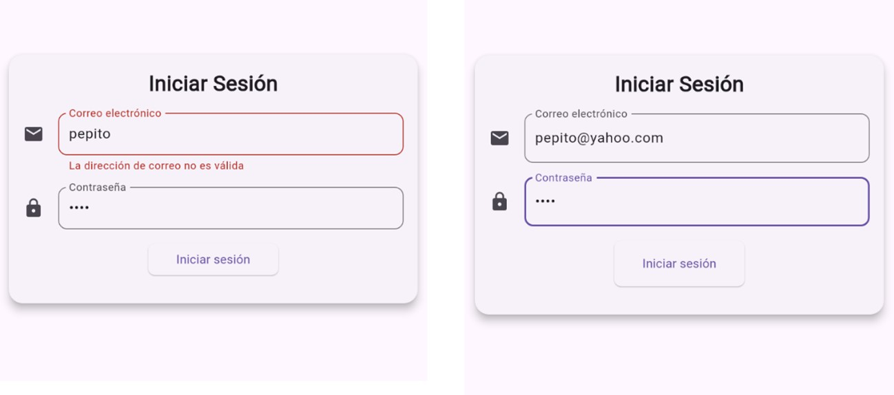
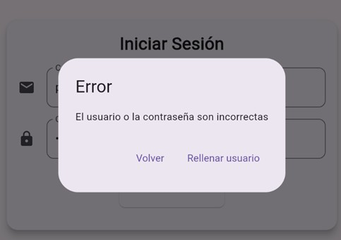
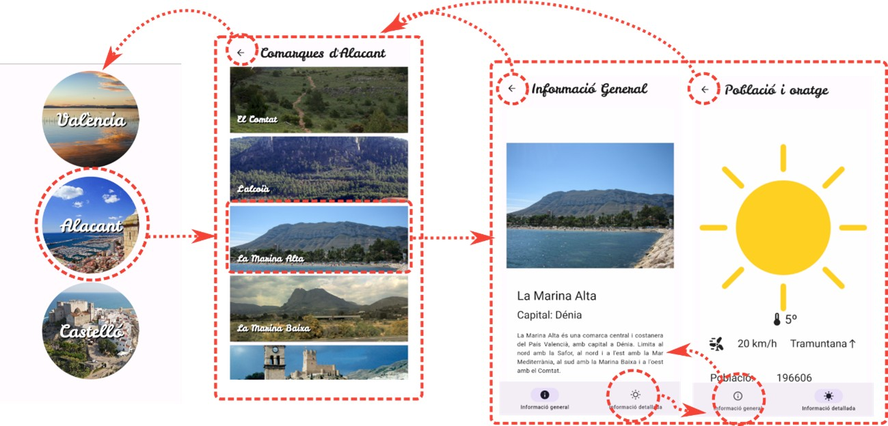

   

 
 

# Práctica 4. Formularios y Navegación 

Para esta tarea vamos a enlazar las distintas pantallas que generamos en la práctica 3, de manera que podamos navegar entre ellas.

En esta práctica utilizaremos una clase que nos proporcionará, a través del repositorio, la información sobre las diferentes provincias y comarcas. En prácticas posteriores enlazaremos este repositorio con la información que obtuvimos a través de la API en la práctica 1.

## Pantalla inicial. Formulario.

La pantalla inicial será un formulario con el siguiente funcionamiento:
 

 
Al pulsar **Iniciar sesión**, si el usuario y la contraseña son correctas (las elegís vosotros…) entraremos a la aplicación de comarcas (a la pantalla de Provincias).

En el caso que el usuario y/o la contraseña no sean correctas aparecerá un Diálogo con el siguiente aspecto:
 

Si el usuario pulsa **Volver** cerraremos el diálogo volviendo al formulario con los datos que hubiera.

En el caso que se pulse **Rellenar usuario** volveremos al formulario, pero habremos puesto en los TextField el usuario y la contraseña correctos para poder entrar en la aplicación.

 

## Aplicación. Navegación entre pantallas.

Una vez que, a través del formulario, hayamos entrado en la aplicación, el esquema de navegación que implementaremos será el siguiente:
 

- Desde la pantalla de **Provincias**, podremos hacer click en cada una de ellas para navegar con las comarcas de esa provincia. Os puede ayudar para este propósito el widget `GestureDetector`.

- La pantalla de **Comarcas** (tendrá un texto en la AppBar), permitirá seleccionar una comarca y navegar a la pantalla con información sobre la misma.

- La pantalla de información de la comarca se creará nueva y tendrá un `Scaffold` con una barra de navegación que utilizará los widgets diseñados en la práctica anterior (habrá que quitarles el Scaffold). En la AppBar nos aparecerá información de lo que estamos mostrando. De momento la información del tiempo la dejamos como en la práctica anterior.

 

## Obtención de la Información de las Comarcas

En la práctica anterior recuperábamos la información a través de la clase `RepositoryEjemplo`.

En esta práctica vamos a trabajar ya con todos los datos sobre las provincias y las comarcas. Esta información se encuentra en la clase `RepositoryData` y se accede a ella a través de la clase `RepositoryEjemplo`. Tenéis en aules un fichero llamado **repository.zip** en el cuál encontraréis los dos ficheros con esas dos clases.

Nos encontramos en `RepositoryEjemplo` los métodos que utilizábamos antes, pero con algunos cambios:

- El método `obtenerProvincias()` obtendrá la lista de provincias de la clase `RepositoryData`. Lo tenéis implementado, pero es interesante entender cómo funciona.

- El método `obtenerComarcas()` recibirá ahora un `String` con el nombre de la provincia de la que deseamos obtener las comarcas, y lo que hace es utilizar la clase `RepositoryData` para localizar la provincia y devolver una lista JSON con los nombres y las imágenes correspondientes a la provincia. Este método también está implementado.
  
- El método `obtenerInfoComarca()` recibirá un `String` con el nombre de la comarca de la que deseamos obtener la información. Este método **lo debéis implementar vosotros**. Se recorrerá toda la información de provincias y comarcas y devolverá un objeto de tipo `Comarca` cuando encuentre la comarca con el nombre que se busca. Observad cómo trabajan los métodos anteriores y recordad el constructor `fromJSON` de la clase `Comarca`.

 
 

Para la ENTREGA de la práctica recordad hacer `flutter clean` para que esta llegue limpia y entregad también un pequeño pdf en el que expliquéis los pasos para la implementación de las distintas pantallas y las dificultades encontradas.

